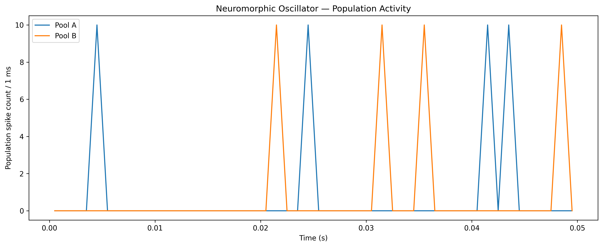
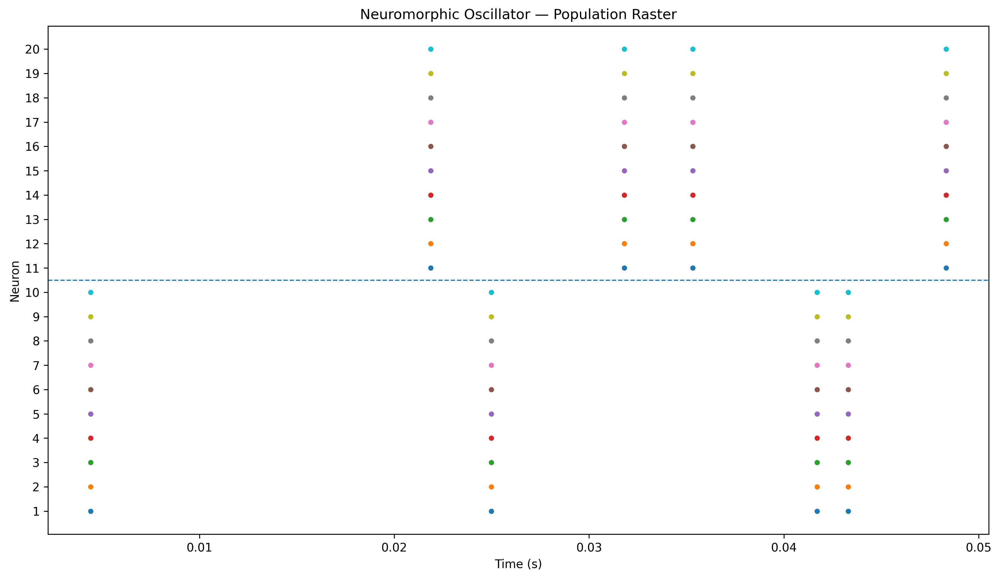

# moose2026hackathon.ipynb# MOOSE Hackathon 2026 — Neuromorphic Oscillator

## Overview

This project presents a population-based neuromorphic oscillator developed using the **MOOSE (Multiscale Object-Oriented Simulation Environment)** simulator.

The model consists of two competing populations of leaky integrate-and-fire (LIF) neurons. The populations receive constant tonic bias currents and interact through fixed reciprocal inhibitory connections. The aim is to investigate how internally generated neuronal dynamics and inhibitory feedback can produce structured alternating population activity without an externally imposed clock or oscillatory input.

## Problem Statement

The MOOSE Hackathon 2026 challenge asks participants to construct a population-based neuromorphic oscillator suitable for clockless pulse-generation applications.

The required architecture is based on two competing neuronal pools in which activity in one pool suppresses activity in the opposing pool. The oscillatory behaviour must emerge from the internal neuronal dynamics and feedback network rather than from an externally supplied oscillating signal.

The model must also respect Dale's Law, remain within the 100-neuron silicon budget, and use a fixed hardwired connectome during simulation.

## Network Architecture

The final network contains two neuronal pools:

* **Pool A:** 10 LIF neurons
* **Pool B:** 10 LIF neurons
* **Total:** 20 neurons

The two pools are connected through reciprocal inhibitory synaptic connections.

Each neuron in Pool A inhibits neurons in Pool B, while neurons in Pool B inhibit neurons in Pool A. The synaptic routing is established before the simulation and is not modified during runtime.

The final model therefore contains:

**200 fixed inhibitory connections**

The network uses constant tonic input currents:

* Pool A: **2.0 × 10⁻⁹ A**
* Pool B: **1.9 × 10⁻⁹ A**

The final parameter test used:

* Synaptic conductance (`Gbar`): **3 × 10⁻⁹ S**
* Synaptic delay: **0.01 s**
* Simulation duration: **0.05 s**

No external sine wave, function generator, digital clock pulse, or time-varying input was used to drive the oscillator.

## Methodology

The model was developed progressively.

### 1. LIF neuron dynamics

Individual LIF neurons were first configured and tested using constant input currents. Membrane potential traces were recorded to verify integration, threshold crossing, firing, and reset behaviour.

### 2. Inhibitory interaction

Reciprocal inhibitory synaptic interactions were then introduced between competing neurons. Different synaptic strengths and tonic input conditions were explored to examine the effect of inhibition on neuronal activity.

### 3. Population network

The model was extended to two populations of 10 neurons each. Each population receives constant tonic drive and inhibitory feedback from the opposing population.

### 4. Population analysis

Spike events were detected from membrane-potential threshold crossings. The resulting spike times were used to calculate:

* Total spikes in each pool
* Mean spikes per neuron
* Population activity in 1 ms bins
* Individual neuronal firing patterns through a raster plot

## Final Simulation Results

The final population simulation produced:

| Measurement                  |       Result |
| ---------------------------- | -----------: |
| Total neurons                |           20 |
| Pool A neurons               |           10 |
| Pool B neurons               |           10 |
| Pool A spikes                |           40 |
| Pool B spikes                |           40 |
| Total detected spikes        |           80 |
| Fixed inhibitory connections |          200 |
| Pool A tonic input           | 2.0 × 10⁻⁹ A |
| Pool B tonic input           | 1.9 × 10⁻⁹ A |
| Synaptic conductance         |   3 × 10⁻⁹ S |
| Synaptic delay               |       0.01 s |
| Simulation duration          |       0.05 s |

The equal total spike counts from the two pools indicate balanced overall activity under the final tested parameter condition.

## Population Activity

The population activity plot shows the number of detected spikes from each pool within 1 ms time bins.



This representation allows the collective firing behaviour of the two neuronal populations to be compared directly over time.

## Population Raster

The raster plot displays the firing events of all 20 neurons individually.



The raster demonstrates synchronized firing within the neuronal pools and shows the temporal competition between Pool A and Pool B.

## Interpretation

The simulation demonstrates that structured population activity can emerge from the combination of:

1. Constant tonic neuronal drive
2. LIF membrane dynamics
3. Fixed reciprocal inhibitory connectivity
4. Synaptic delays
5. Nonlinear threshold-and-reset behaviour

Importantly, the temporal structure is generated internally by the network rather than being imposed by an external oscillatory signal.

The progressive experiments also demonstrate how changing tonic input and synaptic conductance modifies the balance between the two competing populations.

The final parameter condition produced balanced total activity, with 40 detected spikes in each population during the 50 ms simulation.

The resulting dynamics provide a computational demonstration of reciprocal inhibitory competition in a neuromorphic network and serve as a basis for investigating more sustained anti-phase oscillatory behaviour.

## Compliance With Hackathon Constraints

### Tonic bias only

All neuronal driving currents are constant during the simulation. No external oscillatory waveform or digital clock signal is used.

### Dale's Law

The final network uses inhibitory synaptic connections between the two competing populations. Individual neurons are not dynamically switched between excitatory and inhibitory behaviour.

### 100-neuron budget

The final network contains only **20 neurons**, well below the maximum budget of 100 neurons.

### Fixed hardwired connectome

The reciprocal inhibitory connections are established before the simulation and remain fixed during runtime.

## Repository Contents

```text
moose2026hackathon/
│
├── moose2026hackathon.ipynb
├── population_activity.png
├── population_raster.png
└── README.md
```

### `moose2026hackathon.ipynb`

Contains the complete MOOSE simulation, model development, parameter experiments, spike analysis, and final population simulation.

### `population_activity.png`

Final population-level spike activity plot.

### `population_raster.png`

Final raster plot showing individual neuronal firing events.

## Requirements

The notebook requires:

* Python
* MOOSE
* NumPy
* Matplotlib

The model was developed and tested in Google Colab.

## Running the Project

1. Open `moose2026hackathon.ipynb` in Google Colab.
2. Ensure the required Python packages are available.
3. Run the notebook from top to bottom using **Run All**.
4. The notebook constructs the neuronal network and performs the simulations.
5. The final analysis generates population activity and raster plots.

The included PNG files provide the final simulation outputs without requiring the notebook to be executed.

## Conclusion

This project demonstrates a compact neuromorphic network in MOOSE consisting of two reciprocally inhibitory neuronal populations driven exclusively by constant tonic currents.

The final 20-neuron network generated activity in both populations and produced 80 detected spikes during the 50 ms simulation. The population activity and raster visualizations provide direct evidence of the resulting network dynamics.

The work demonstrates the core principle of generating temporal structure through nonlinear neuronal dynamics and fixed inhibitory feedback rather than through an external clock, providing a computational foundation for neuromorphic pulse-generation architectures.
